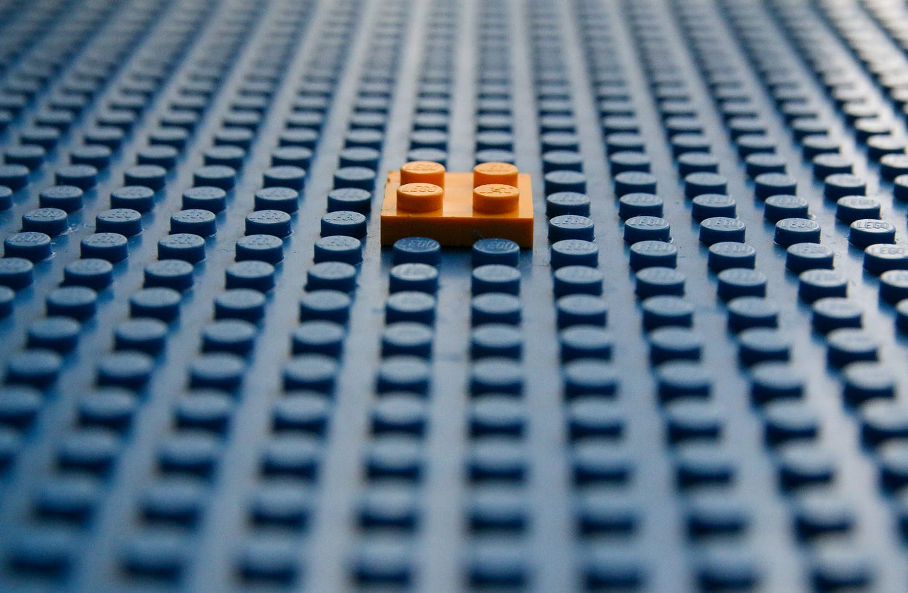

Recently I finished Coursera’s excellent _Learning How To Learn_ course. It made me reflect on my habits and what makes up efficient learning. Considering the dynamic nature of the ever-changing world, this skill is of utmost importance.

Learning is also at the core of solving the most complex problems and overcoming daunting challenges.

In this article, I will pinpoint some of the key ideas from the course mixed with my own experience.

## Modes of Thinking

As stated in the course, neuroscience recognizes two modes of thinking. They are called “Focused mode” and “Diffuse mode.” They are polar opposites but work miraculously well when combined. Both are equally crucial in optimal learning strategies.

**Focused mode** is the state of deep concentration on a problem or a task at hand. By deep concentration, I mean focus with absolutely no distractions for a period of time. Usually, this involves using already established patterns.

The main strength of focused thinking is that it uses the analytical problem-solving part of the brain. It is excellent for trying to understand concepts or solving problems sequentially.

**Diffuse mode**, on the other hand, is a more relaxed thinking mode. For that reason, it is often overlooked. This thinking mode occurs when we are not heavily focusing on anything. Even though we are not consciously concentrating on a task, our brains continue to process the information.

The main strength of diffuse thinking is that unexpected connections between concepts and ideas are being formed. It is great for looking at things from a broader big-picture perspective. Diffuse mode of thinking is triggered by activities such as going for a walk, working out, meditating, taking a shower, or even napping.

The juxtaposition of deep focus and relaxation is in itself remarkable. Neuroscientists suggest that a person can be in only one of these two modes at a given time. Fundamentally, the main idea is to take advantage of both focused and diffuse modes when trying to grasp a challenging new concept. A deep focus session followed by a relaxing activity allows the brain to work its magic.

## Chunking

A fantastic way to learn is through the process of chunking. By definition, chunking is the brain’s function to unite information through meaning. If we go even deeper, a chunk can be defined as a network of neurons used to firing together.

It is easier to think of chunks as the building blocks of a Lego constructor. At first, the pieces are scattered all over the place. When one sits down and starts combining them in the proper order, different patterns begin to emerge. If we repeat this process enough times, we will eventually get to a point where everything comes together, and we get the desired result.

In the beginning, we think very little about the details. We only have a high-level overview of the big picture. Everything gets clear in the process.

It is essential to take our time to combine the pieces in the correct order. If, instead, we started randomly assembling them without paying much attention, the result would not have been satisfying.

When trying to learn something new for the first time, our thought process is reminiscent of such a constructor.

Initially, trying to form a vision for the big picture is a good idea. All parts of it might look disjointed and sporadic at first, but that is because we are yet to build the mental force to make sense of them.

The first building block is being set by looking at the big picture and getting a vague feeling for the domain itself.

Chunks are best formed when we are in the focused mode of thinking. To reinforce our chunks further, repetition and deliberate practice are required. With each deep focused study session, the small chunks become larger, and the path to mastery is being forged step by step.

Once chunks become big enough, we can connect the dots to form the truly creative interpretations of the material we are trying to master. This process also leads to many innovative solutions. Building up these patterns in our mental artillery also allows us to apply them interdisciplinarily.

## Knowledge Retention

One of the most common concerns when learning something is how to retain the information. When we think of school or college, countless memories of tests and exams arise, but we hardly remember every detail. Sometimes even topics we had once memorized are now blurry if present. To explore potential reasons for that, we need to examine the differences between long-term and working memory.

As explained in the course, **working memory** has to do with what is immediately and consciously processed in our minds. Whenever we are trying to learn something for the first time, it is initially stored in the working memory.

The brain automatically groups and sorts the items into chunks. Neuroscientists believe that most people can hold up to four chunks simultaneously. We already know that chunks can expand. Therefore, it may seem that the working memory is bigger than it is.

That said, information retained in the working memory tends to fade away quickly. It is especially the case when we do not revisit a thing for some time. We signal the brain that we would not need this information. It is the brain’s function for freeing up slots for new information.

On the other hand, **long-term memory** is sort of like a database that can store billions of records. Since it can keep many things, the brain scatters them in different regions. The tricky part, however, is that, unlike an actual database, storing information in long-term memory needs some work on our side.

Retaining any knowledge comes down to transferring it from the working memory to the long-term memory. Retention happens with time and repetition. The more time we spend deliberately practicing and learning, the closer we get to completing the transfer.

**Spaced repetition** is a famous empirically proven technique that can significantly aid us. It comes down to testing ourselves on what we have learned over a period of time. We gradually increase the intervals between sessions with each successful session until the concepts come naturally.

Flashcards are an excellent tool for spaced repetition. Anki is a free, open-source software that can accelerate the process. First write a question or a problem on one side and the answer on the other. Then you can shuffle the cards and test your knowledge during a study session.

## Illusion of Competence

Now that we have gone through most of the theory, it’s time to look at one of the major traps we may find ourselves in. I have been guilty of that at one point or another throughout my studying journey.

The **illusion of competence** occurs when we overestimate our depth in a given subject. It might showcase itself on a smaller scale as well. Say you are trying to learn something and reach a point when you are confident that the concept is solidified in your memory, only to fade away a day or two later.

We should be able to work out and solve the problem ourselves. For example, that “Aha!” moment we experience when we see an elegant solution to a problem might lead us directly into the trap if we do not practice. Only when we begin to work out the solutions ourselves can we get the depth of the knowledge we are trying to acquire.

Numerous times, I thought I had a concept nailed down just by looking. The realization often kicked in later when I had to reproduce or use it without any reference.

Another common mistake is testing ourselves while we have the source in front of us. Such tests would not be very beneficial as, in most cases, we would be tempted to look at it at first sight of uncertainty.

A great way to counter this is through a self-explanatory technique called **recall**. It comes down to trying to remember what you have studied without looking and then checking if it is correct.

Let’s try to do this now.

Don’t scroll.

Think briefly about which of the mentioned ideas about learning you found most interesting.

By doing this, you deliberately triggered recall and are one step closer to transferring this knowledge to your long-term memory.

It is also beneficial to try to recall things in an environment different from your usual study place.

The illusion is dispelled through practice, testing, and recall.

Once the material becomes second nature, we can assume that the knowledge is understood correctly.

## Practical Tips

After we have gone through the theory, here is a list of eight practical tips for efficient learning that I have found most helpful throughout my journey:

1. **Define your learning goals and keep track of your progress**  
   Take the time to really think about what you are trying to achieve with your learning. Whether it is craft mastery, curiosity, a study plan for a job interview, or an upcoming test, it needs to be meaningful to you. Make quantifiable goals and revisit them after each learning session. This will fine-tune your thinking process, and you will get a constant reminder of why you started in the first place. Better yet, you have a plan that you are following.

2. **Make a habit out of your deep study sessions**  
   Set a schedule for uninterrupted, focused mode learning without any distractions. In the beginning, it may be hard to concentrate for extended periods, so it’s a good idea to experiment with the duration of the sessions. Start with just 25 minutes and work towards an hour and beyond. Techniques such as “Pomodoro” might be helpful. I have found that an hour and a half is optimal for going into a flow state.

3. **Replace overlearning in favor of deliberate practice**  
   Overlearning is a lot like staying in our comfort zones. Once we have mastered a concept, it does not make sense to repeat it over and over again. Instead of focusing on things that are already easy for us, we should focus on the hard material that requires focused work. Rereading the same thing for the nth time would not get us closer to our goals.

4. **Find a sustainable routine and optimize as you go along**  
   When starting, it is easy to have unrealistic expectations of your current capabilities. Perhaps you imagine yourself crushing five-hour deep study sessions daily. You do it once and then feel bad for not repeating it the day after. The tricky part is, to be honest with yourself and build a routine that works for you. For example, I have always been a night owl. My deep learning sessions are during nighttime. This works wonders for me as I have found it sustainable and productive. Routines are anything but “one-size-fits-all,” so you must experiment to find yours. You will tweak it as you go.

5. **Keep track of the cues to your bad habits and work on them**  
   A lot of our good and bad habits have cues that trigger them. Whenever you find yourself indulging in something you would like to change, notice your behavior and think about what triggered it in the first place. Try to replace the bad ones by creating new triggers for the good ones. For example, play a favorite song of yours before each session. After a while, this would signal the brain to prepare for what’s to come.

6. **No zero days rule and getting back on track**  
   This is probably the hardest tip on the list. After you have decided on what you want to learn, make an effort to do it daily. It does not have to be full sessions each day. Use some days just for recall and reflection. Use others to think about the big picture. Such fixation is remarkable for keeping our minds engaged. Whatever we do, sometimes life gets in the way. We should reevaluate and immediately get back on track. Learning is not a linear path with a binary outcome. The progress we have made is not lost. Process over product.

7. **Be physically active and sleep well**  
   As noted, physical activity is vital for our well-being and learning. It allows the mind to switch to diffuse mode and process the information. Sleep is equally important. Our minds require it to run optimally. Work on your sleeping habits to get 7–8 hours of sleep every night.

8. **Don’t be afraid to take a rest**  
   Reward yourself for completing tasks and sticking to your routine. The last thing you would want is to risk burnout. Having quality downtime is beneficial and important. I used to beat myself up for not being constantly focused. This isn’t healthy, nor is it sustainable. It also leads to mental and creative roadblocks. Rest might give you new points of view on the problems you are trying to solve. Cherish it.

## Conclusion

Learning is one of the most beautiful things in our lives. It leads to exposure to beautiful ideas, working on interesting problems, and, most of all, a fulfilling life.

Through their learning and deliberate practice, some people reach mastery that pushes forward art and science. Their work and creativity transcend beyond their lives.

It is objectively true that our time here is limited. Our lives may be short, but they are just long enough so we can learn a few things.

This thought is liberating.

In addition, we are lucky to have more resources than ever in history. They are free and there for us to explore. If you’re at a crossroads about what to learn, choose one of the paths and revisit the other later.

Here is a quote by Derek Sivers from an awesome blog post of his:

> Most people overestimate what they can do in one year, and underestimate what they can do in ten years.

Start now.

Happy learning! 🚀

If you want to get in touch, don’t hesitate to message me.  
Follow me on [GitHub](#).  
Connect with me on [LinkedIn](#).
