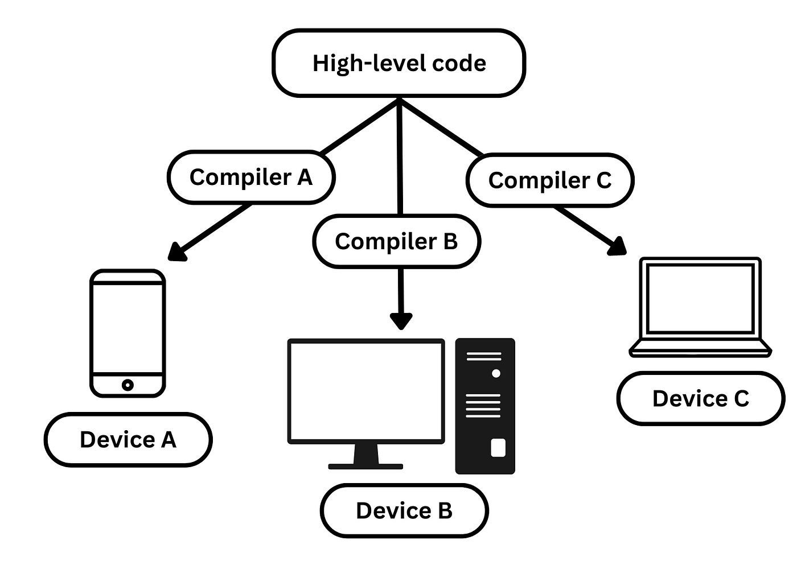
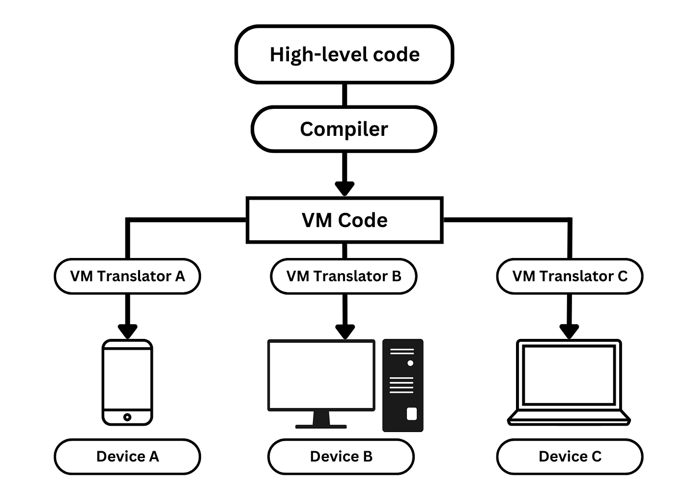

Nowadays, in computer science, we take cross-platform code support for granted. With ecosystems like the reformed .NET, it is easy to get carried away and forget the underlying brilliant ideas that paved the way forward. To understand the significant problem of implementing a cross-platform language and the root of its solution, we have to define some terminology and go back to the craziness of the 1970s.

Every line of high-level code that gets compiled, sooner or later, becomes a sequence of n-bit binary instructions. For example, a 16-bit computer implies that its processor can compute simultaneously everything up to 16 bits. It is also in union with its registers and buses. A sample instruction for such a computer can look like this: “1111 1101 1101 1000” or “0000 0000 0000 0111”. Of course, looking at it right now without being familiar with the specifications of the instructions that the computer supports, it is hardly possible to derive any meaning.

Moreover, even if we were proficient, it would not have made our lives much easier since 0s and 1s aren’t exactly human-friendly. But they shouldn’t be since they aren’t for us to read. They are for the computer to execute, and it does not have such problems. To make our lives a tiny bit easier, a human-readable representation of that machine code exists, and it is what we call assembly. Each computer architecture has its own assembly language. With the help of mnemonics, each assembly language comes with a specific set of instructions and features.

An assembler is a program that translates the assembly language to binary code. Since it transforms one language (assembly) to another (machine code), it can also be classified as a compiler.

So far, so good, but at this point, you may be wondering where does this assembly code come from. After all, unless you’re fighting some inner demons, it’s not that common to write assembly language in the first place. The high-level code that we’re writing gets compiled to assembly language during the process of compilation. The program responsible for this is called a compiler.

One very important thing that we mentioned is that each computer architecture has its own assembly language. This means that if we want our high-level code to run on n devices with different architectures, we would also need n amount of compilers. This is the process of single-tier compilation.

This poses a difficult but interesting problem. Writing a compiler is not an easy task. Writing a few of them while handling the specifics of each architecture even less.

Some other cons of the single-tier approach are:

- **Coupled code** — the result of the compilation will always be coupled with the target architecture. This takes a toll on portability since there’s absolutely no guarantee that the code will function properly on any other hardware.
- **Slower optimization rollout** — following the above point, each compiler will need to service an architecture with its own unique features and peculiarities. Optimizing code for each platform will be time-consuming.
- **Maintainability** — to top it all off, once the compilers are fully working, they also need to be maintained. The need to support multiple of them can lead to longer development cycles.

Examples of programming languages that use single-tier compilation are C and C++. They were developed in an era where computing resources were limited. Oftentimes compiling directly to machine code can be more useful when performance is a primary concern. Optimization can also be more fine-tuned towards the specific needs of the target platform.

## Origin of the Solution

The problem of single-tier application became evident as more and more companies started getting into the business of coming up with their own architecture. As computer science was growing as a field, the necessity to be able to run your code on different systems became a need.

To solve this complicated problem, a handful of computer scientists in the 70s came up with a brilliant solution by introducing a virtual machine called a p-code machine (or portable-code machine).

Their motivation was to make executing programs written in Pascal possible on various computer architectures without rewriting the compiler for each platform. Their compiler was written in Zurich in 1973 and became known as the Pascal-P system.

Two years later in 1975, Niklaus Wirth, the legendary original designer of Pascal, developed another p-code generating machine in the form of the Pascal-S compiler.

Even though the Pascal family coined the term p-code machine, the first implementation of two-tier compilation can be traced back even further. We can go back to 1967 and explore the programming language “BCPL” or “Basic Combined Programming Language”. A simple and portable language created with the goal of writing compilers for other languages in mind.

Its version of intermediate language is called “O-code”. Even though “BCPL” is not being used at all, it is one of the most influential languages. Not only did it introduce curly braces to delimit code, but it also became the backbone of the language “B” which later on became the basis for “C”.

The solution to the cross-platform problem was revolutionary in that it implemented a beautiful idea that retrospectively proved to be a monumental advancement in the field of compilers. The solution itself became known as two-tier compilation.

## Introducing Two-tier Compilation

In essence, two-tier compilation introduces an intermediary phase that significantly simplifies the problem at hand. The initial tier involves transforming high-level code into an intermediate language, known as the front-end. Subsequently, the backend comes into play, where this intermediate code is converted into the targeted assembly code. To grasp this concept fully, we should delve into the significance of virtual machines, as they play a central role in this intricate process.

We can think of a virtual machine as an abstraction of a computer system. It is an imaginary artifact. Creating a virtual machine is an example of virtualization in the context of computer science. It’s one of the most important ideas in the field since it’s used in modern programming languages, cloud computing, and networks.

In our case, the virtual machine is used as a universal artifact whose semantics are well-known to everyone that’s ever going to use it.

Imagine you’re in a room with two individuals, one speaking French and the other speaking Japanese. They need to communicate via text, but their linguistic diversity creates a barrier. However, envision a scenario where both individuals understand a common intermediate language. In this case, communication becomes efficient. Moreover, the specific language spoken by the second person is secondary as long as they understand the intermediate language.

The analogy here is that the virtual machine serves as a standardized construct between high-level code and a target platform. Translating to and from a familiar language is far simpler than doing so in an entirely novel one.

The main benefit of this approach lies in the versatility it offers. The same compiler used for translating from high-level code to intermediate language can be used across different platforms. Furthermore, this compiled intermediate language is universally understood by these platforms. This solid foundation serves as a cornerstone for constructing a cross-platform programming language.

## Modern Implementations

In the realm of modern programming languages, two-tier compilation plays a pivotal role in enabling code to run on various platforms seamlessly.

**Java**, with its famous slogan ‘write once, run everywhere,’ embodies this model. In Java, the high-level code is compiled into an intermediate form known as Bytecode. This Bytecode can then be executed on any platform equipped with the Java Virtual Machine (JVM).

Similarly, in the case of **C#**, the high-level code is compiled into Common Intermediate Language (CIL). This CIL code is designed to be platform-agnostic and can be executed on any system running the Common Language Runtime (CLR).

It’s worth noting that while this is a simplified overview, the actual process involves intricate details and numerous moving parts. Our aim here is to provide a high-level understanding and hopefully ignite an interest in the fascinating world of compilers.

If you want to get your feet wet, a great resource on the topic is the second part of the astonishing course “Nand2Tetris”. While the first part of the course guides you through the construction of a computer from the ground up, the second one focuses mainly on implementing a VM Translator and a compiler that closely follow the two-tier compilation model.

Both parts of the course present a worthwhile challenge that will leave you with a greater understanding of computation in general.

## Conclusion

Lately, I’ve been exploring these topics myself, and it got me thinking about the underlying beauty of the abstractions on which the world operates. So many things we take for granted, and we can go our whole lives without even dipping a foot into these magnificent worlds.

Even though it’s an overwhelming and daunting task, peeling down the layers of abstraction in search of a better understanding of the world reveals numerous elegant mechanisms working in sync to make the modern tech-driven world possible.

It’s a journey driven by curiosity, with the beautiful revelation at the end that even the most sophisticated ideas are built on top of logic and foundational principles.

Here is a quote by Paul Graham from an insightful blog post of his:

> Curiosity is the best guide. Your curiosity never lies, and it knows more than you do about what’s worth paying attention to.

Happy hacking! 🚀

If you want to get in touch, don’t hesitate to message me.  
Follow me on [GitHub](#).  
Connect with me on [LinkedIn](#).
